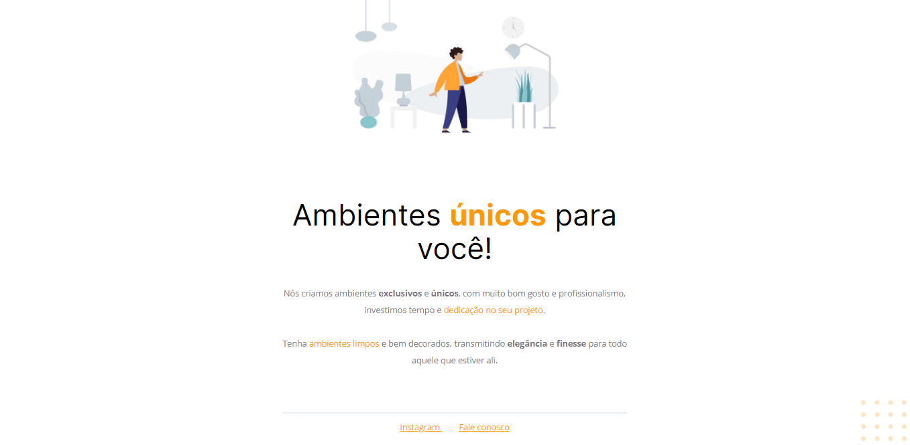

# 🚀 Trilha Explorer

> Projeto desenvolvido durante o curso Explorer da Rocketseat!

[🔗Clique para acessar](https://moveis-customizados-psi.vercel.app/)

## 🛠 Tecnologias utilizadas

- HTML
- CSS
- Git e Github

## 💻 Contato

isabelalvaro116@gmail.com